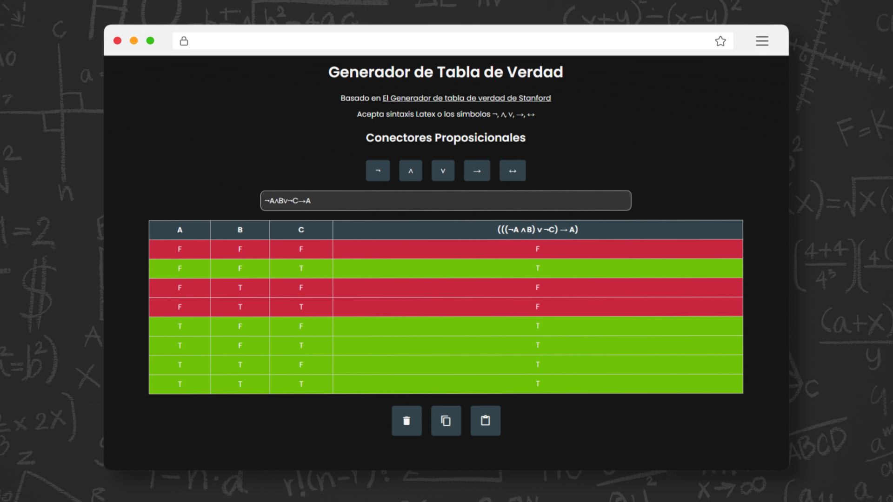

# Generador de Tabla de Verdad  




## Descripción
Este proyecto es un **Generador de Tabla de Verdad** interactivo que permite crear tablas de verdad a partir de expresiones lógicas proposicionales. Está inspirado en la implementación de la Universidad de Stanford y ofrece una interfaz simple y amigable para trabajar con conectores lógicos como ¬, ∧, ∨, →, ↔, además de soportar sintaxis LaTeX.

## Características
- **Soporte de Operadores**: Acepta operadores lógicos estándar y expresiones en LaTeX.
- **Visualización Clara**: Resalta los valores `True` y `False` en la tabla generada.
- **Interfaz Intuitiva**: Fácil de usar con botones para copiar, pegar y limpiar expresiones.
- **Basado en Stanford**: Inspirado en el generador de tablas de verdad de [Stanford](https://web.stanford.edu/class/cs103/tools/truth-table-tool/).

## Instalación
```bash
git clone https://github.com/GutBla/Generador_de_Tabla_de_Verdad.git
```

## Demo en Vivo
Puedes acceder a una versión en vivo del generador desde el siguiente enlace:  
https://gutbla.github.io/Generador_de_Tabla_de_Verdad/

## Uso
1. Ingresa una fórmula lógica en el campo de texto utilizando los conectores proposicionales o la sintaxis LaTeX.
2. La tabla de verdad se generará automáticamente, resaltando los valores de `True` y `False`.
3. Utiliza los botones disponibles para limpiar la fórmula, copiar la expresión o pegar la tabla generada.
